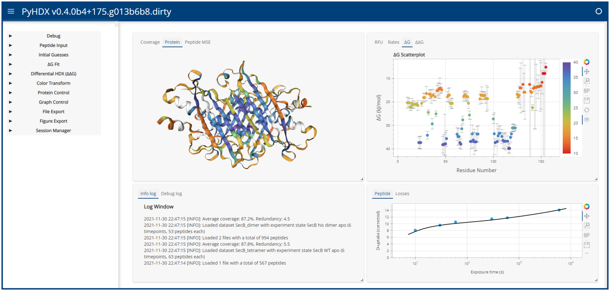

# PyHDX

[](https://zenodo.org/badge/latestdoi/206772076)
[](https://www.biorxiv.org/content/10.1101/2020.09.30.320887v2)
[](https://opensource.org/licenses/MIT)
[](https://github.com/Jhsmit/PyHDX/actions?query=workflow%3Apytest)
[](https://pyhdx.readthedocs.io/en/latest/?badge=latest)


PyHDX is python project which can be used to derive Gibbs free energy from HDX-MS data.


[PyHDX stable documentation](https://pyhdx.readthedocs.io/en/stable/)

[PyHDX on YouTube](https://www.youtube.com/channel/UCTro6Iv1BhvjUPYZNu5TJWg)

[](http://pyhdx.jhsmit.org/)

## Installation

Installation of the latest stable beta with `pip`:

```bash
$ pip install pyhdx
```

Installation with web interface extra:

```bash
$ pip install pyhdx[web]
```

Conda install (includes web interface extra):

```bash
$ conda install pyhdx
```

# Run PyHDX

Most up-to-date code examples are in the directory `pyhdx/templates`

To run the web server:

```bash
$ pyhdx serve
```
    
Please refer to the [docs](https://pyhdx.readthedocs.io/en/stable/) for more details on how to run PyHDX.

## Web Application

The PyHDX web application is currently hosted at:
http://pyhdx.jhsmit.org

A test file can be downloaded from [here](https://raw.githubusercontent.com/Jhsmit/PyHDX/master/tests/test_data/input/ecSecB_apo.csv) and [here](https://raw.githubusercontent.com/Jhsmit/PyHDX/master/tests/test_data/input/ecSecB_dimer.csv>) (right click, save as).

A beta version might be available at:
http://pyhdx-beta.jhsmit.org

The latest beta docs are found [here](https://pyhdx.readthedocs.io/en/latest/)


## Publication

Our Analytical Chemistry Publication describing PyHDX can be found [here](https://doi.org/10.1021/acs.analchem.1c02155)

The latest version (v2) of our biorxiv paper: https://doi.org/10.1101/2020.09.30.320887 

Python code for analysis and generation the figures in the paper are here: https://github.com/Jhsmit/PyHDX-paper

## Other

HDX MS datasets repository and format (alpha):
https://github.com/Jhsmit/HDX-MS-datasets

HDXMS datasets python bindings:
https://github.com/Jhsmit/hdxms-datasets
