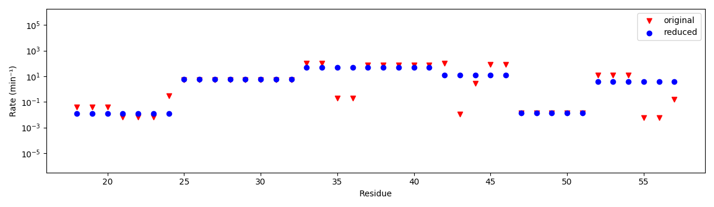

=======
Fitting
=======

The main feature of pyHDX is the fitting of rate equations describing deuterium uptake to a kinetic series of measured
peptides each covering a section of residues with a corresponding amount of deuterium uptake per peptide-timepoint.

Definition of residue blocks
----------------------------

The overall coverage and the spatial distribution of peptides along a protein sequences ultimately determines the residue
level resolution that can be reached. Theoretically, by combining the information from multiple peptides each reporting
on the deuterium uptake of a different part of the protein, the limit of spatial resolution that can be reached is
limited to 'blocks' or 'subfragments' (XX) of amino acids whose sets of peptides they appear in is unique (Figure XX).
(REF Gessner XX)

.. _blocks_original:
.. figure:: figures/blocks_original.png
    :scale: 25 %
    :figclass: align-center

    Blocks of residues from overlapping peptides.

Figure :numref:`blocks_original` shows an example of a set of peptides obtained for the protein SecB. This particular
peptide coverage configuration results in a total of 16 blocks of amino acids.

However, in practise, we found that in this limit of spatial resolution, the model will have too many fit parameters and
overfitting will occur. This phenomenon manifests itself as narrow spikes of one or several amino acids being assigned an
exchange rate at extrema of the kinetic limits.

.. _blocks_reduced:
.. figure:: figures/blocks_reduced.png
    :scale: 25 %
    :figclass: align-center

    Reduced blocks of residues to reduce the number of fitting parameters.

To circumvent this, some of the spatial resolution is sacrificed by combining blocks of residues and thereby lowering the
amount of fit parameters. pyHDX offers a default algorithms for this block reduction but either the algorithms to do so or
the exact layout of the blocks can be customized. The resulting blocks using this default algorithm can be seen in Figure
:numref:`blocks_reduced`.

Overfitting
-----------

Overfitting occurs when more parameters are added to the model but the supplied data has insufficient independent datapoints
to be able to accurately and uniquely determine the value of these parameters. Typical signs of overfitting are large
variations along residues in the obtained rates, such as for residue 43 in Figure :numref:`overfitting`.

.. _overfitting:

    XX not really a great example of overfitting

To determine if overfitting has occurs, the number of fitting parameters should be varied while checking the effect of adding and removing fit parameters againts
goodness-of-fit parameters. This is a laborious and time consuming process and further streamlining and automating this
process is planned to be part of a future release.

In the current implementation, fitting accuracy and residue resolution is sacrificed in order to make sure overfitting is
unlikely. Block size is increased and the number of exchange rate time constants is limited to 2. The downside of this
approach is that the fits can be poor in the case of residues exchanging with more than two distinct rate constants per
block, or that features consisting of only several residues can be missed. Examples of how to customize the defintion of
fitting blocks can be found in the examples section.

Non-identifyability
-------------------

Consider a block of 5 amino acids which all exchange deuterium with very distinct exchange rates and a set of measurements
where the timepoints sufficiently cover these exchange rates. In this scenario, although its possible to extract all 5
kinetic rates by fitting the uptake curve, it is impossible to assign these kinetics rates to individual amino acids. This
is referred to as the non-identifyability issue (XX REF) and this can only be overcome by increasing the number of peptides
such that each amino acid occurs in a unique set of peptides.
